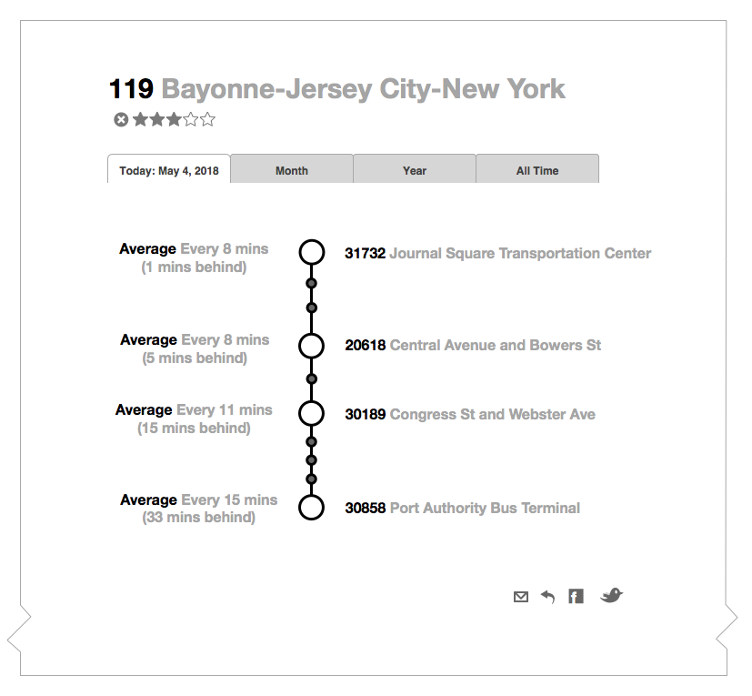

# NJ Transit Bus Report Card
Web app that displays real-time and aggregated performance data for NJTransit bus routes.

## UX Concept

This is a sketch of what we hope to build out. (The OmniGraffle Stencil is in the /ux folder of the repo.)

## Data and Metrics
The data collection is all being handled by the buswatcher project, and will pull from the API being developed there.

There are 3 separate sets of metrics that riders care about we need to calculate.

1. Frequency of service. This is simply calculated by looking at how often a bus on a particular route passes a given stop.
2. Travel time. How long is it taking to get from one stop to the next. We can do this by tracking individual vehicles and seeing how long it takes them to get from one stop to the next.
3. Schedule adherence. Is the bus actually hitting its scheduled stops. This is more of an issue on less frequent routes, and its becoming less important as more people use apps to meet the bus. At rush time its often not at all important. But its pretty easy to do, comparing against GTFS timetables, so lets do it.

## Challenges

- need a good way to localize a lat-lon bus position to a stop. e.g. it has 'arrived.' one way woudl be to separately hit  NJTransit MyBusNow API, which provides arrival time predictions for each stop and will say 'approaching' when it reaches a critical proximity threshold. otherwise we need to reinvent this somehow using a geofence.

