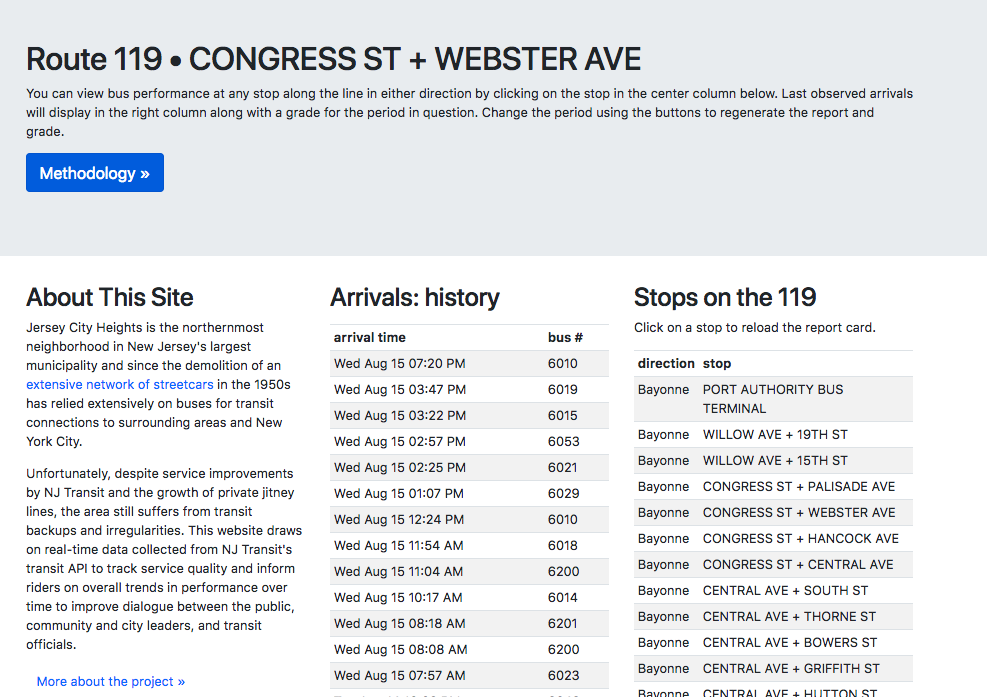

# Bus Rider Report Card 
### v 0.1 alpha
##### 15 August 2018


## Summary

This is set of scripts that fetch bus location and arrival prediction data from several API endpoints maintained by NJTransit (via vendor Clever Devices), synthesize and summarize this information, and present to riders in a number of useful ways via a simple, interactive web application. Implementation is in Python using pandas (data management and processing) and flask (web development). 

## Description

Users can explore our archive of arrival data for any stop on any route, fo a variety of pre-determined time periods. In the future, we plan to compute summary statistics and performance grades on the fly for each view. (e.g. "Route 119 for the stop at Webster Av and Congress St is currently performing at grade C+ for the week. That's down from a B last week.") 

### Filters/Views

The data gathered can be viewed along any combination of three criteria:
- Route: 87, 119 
- Stop: numbered stop from NJT database
- Period: history (all time - currently starts early August 2018), weekly, daily

### Current Metrics

V 0.1 provides a bare minimum of arrival information for any selected route, stop, and period

- Actual arrivals.
- Time between arrivals. 

### Future Metrics

- **Frequency of service.**  How often does a bus stop at my corner? This is simply calculated by looking at how often any in-service bus passes a given stop on a particular route. This will require additional period options (e.g. 'weekly-rush hours' or 'history-late nights') or an additional set of filters to confine the resampling to a relevant time period.
- **Bunching.** Related to frequency of service, we want to highlight any events when a bus arrives at a stop within 3 minutes or less than the previous service on the same route. (This is how the NYC MTA is currently defining bunching, according to [Streetsblog](https://nyc.streetsblog.org/2018/08/13/how-the-mta-plans-to-harness-new-technology-to-eliminate-bus-bunching/).
- **Travel time.** How long is it taking buses to get from one stop to the next? We can compare the arrival time of individual vehicles at successive stops along the line to identify which route segments are contributing the most to delays along the line at any given instant, and over time? This will require creating a data structure for route segments which doesn't currently exist (everything is organized around the stops themselves.) 
- **Schedule adherence.** Is the bus actually hitting its scheduled stops? This will require importing and looking up scheduled arrival times in GTFS timetables--initial inspection indicates this will be challenging (but not impossible) as run/service id numbers returned by the API don't seem to correspond to those listed in the GTFS data. How much we prioritize this will depend on community priorities--for rush hour service, it will be much less important; for late-night service, it will be crucial. Generally speaking, as more people use apps to monitor actual arrivals, schedule adherence is less of a pressing concern.
- **Performance Grade** (0-100, A+-F) Ideally, the app should present a letter or numerical grade summarizing performance for the current view to the user. Scaling and calibrating these will be challenging. We have not yet begun to even explore this.


### Look and Feel

This is an earlier wireframe -- v0.1 departs from this somewhat. (The OmniGraffle drawing is in the /ux folder of the repo.)


Here's a screenshot from the alpha release mid-August WIP.



There's a lot of work to do of course., but its kind of amazing how fast you can stand up a data-driven app with flask, jinja, and bootstrap.

## Implementation Details

Written in python as a set of cron-able scripts that pull data once per minute from the Clever Devices API maintained by NJ Transit at http://mybusnow.njtransit.com/bustime/map/. For instance, here are all the buses on the #87, right now: [http://mybusnow.njtransit.com/bustime/map/getBusesForRoute.jsp?route=87](http://mybusnow.njtransit.com/bustime/map/getBusesForRoute.jsp?route=87)

Here's what does what.

### systemwatcher.py
This is a somewhat aggressive grabber that sucks down the entire statewide position report. We don't actually use it, but its provided as the basis from which everything else was derived. Written by Alex Reynolds -- the amazingly efficient object and data structure Alex created here has made the whole project more robust and efficient, as most of the other classes either directly inherit or are otherwise derived from the ones here.

### routewatcher.py 
Pulls only position reports for buses currently running on a single, specific route.

### stopwatcher.py
Pulls arrival predictions from one API call for buses inbound to a specific stop. We iterate over all stops in a route using another API call that pumps out the route points.

### report_card.py
Flask app which renders the report cards for various routes and views.

## How It All Works
The basic theory here-since the NJTransit API doesn't provide a service to tell us when buses actually arrived at their stops--we instead constantly poll the arrival prediction endpointm once per minute, and take note of the last time we 'see' each bus about to reach the stop (e.g. the predicted arrival time is listed as "APPROACHING"). For instance, lets say we're pulling predicted arrivals for my corner stop on the 119, and our approach log looks like this:

- 8:32 am:  3min, 13min, 27min
- 8:33 am   APPROACHING, 12min, 25min
- 8:34 am   11min, 24min

What's happened is that the first bus pulled in, made its call, and departed between 8:33 and 8:34am. So we'll log it as arrival at 8:33am. 

This is a far from perfect method. But compare it to the absolutely [mind-blowing complexity of the tool](https://github.com/Bus-Data-NYC/inferno) that, for instance, the folks at Transit Center developed to interpolate stop calls using lat-lon positions, and you'll see that sometimes simple and consistent is probably better.

FWIW, we always deploy routewatcher.py alongside stopwatcher.py, so we are grabbing the lat, lon, route, and vehicle number to go back and audit the arrival estimates down the road, or plug-in a version of Transit Center's inferno tool. (<----pssst, grad students, two awesome thesis projects here.)


##### URLs

Here are the URLs currently exposed by the flask app.*

###### /nj/{route}/{stop}{period}/approaches
The raw underlying data, pulled from the arrival predictions API for the stop. We cron stopwatcher.py to record the predicted arrival time for each bus once per minute.

###### /nj/{route}/{stop}{period}/arrivals

List of actual "observed" arrival times. These are approximated by reviewing the appraoch log and recording the time of the last observed "APPROACHING" prediction for that vehicle as the time of arrival.

*n.b. the /nj in these routes. we are writing this to be source-agnostic, so they -should- work with any transit agency API provided by Clever Devices. Most of the documentation we used to figure out the API (which is uncodumented), came from the [unofficial guide to the Chicago CTA Bustracker API](https://github.com/harperreed/transitapi/wiki/Unofficial-Bustracker-API]) for instance.

## Resources

#### Transit Center Bus Turnaround
Particularly the [district-level report cards](http://districts.busturnaround.nyc/). There's also some useful service metric definitions there that we may borrow in the future.

>Bunching data are calculated as an average of performance during weekdays between the hours of 10am-4pm, for the months of May and October 2017. These two months are selected because they contain minimal holidays, mild weather (minimizing service disruptions), and fall during the school year.

>Bunching is defined as the percentage of buses that arrive at less than 25 percent of the scheduled interval behind the previous bus. So if Bus #2 is scheduled to arrive eight minutes after Bus #1, but instead Bus #2 arrives less than two minutes after Bus #1, then Bus #2 is considered "bunched". Bus arrival and departure times are estimated using an algorithm developed by Nathan Johnson and Neil Freeman, and applied to the MTA's Bus Time data. More information about Bus Time data is available here.

> Speed is calculated using the same Bus Time data in conjunction with route length information gathered from the MTA's publicly provided GTFS schedules. As presented here at the route level, the travel time from start to finish is simply divided by the route's length to calculate average speed. More details available in the performance API documentation.


## Setting up buswatcher server on Ubuntu Linux

#### I. the buswatcher (he who grabbeth the data)

1. launch a free tier EC2 micro instance (because why pay?) with ubuntu.

2. set the timezone
    ```bash
    sudo dpkg-reconfigure tzdata
    ```

2.  make sure you're up to date
    ```bash
    sudo apt-get update
    sudo apt-get upgrade
    ```
    likely only be a few updates.
    
2. i highly recommend installing and using [mosh](https://mosh.org/), which is more resilient against flaky ssh connections, and open the udp ports it needs to operate
    
    ```bash
    sudo apt-get install mosh
    sudo ufw allow 60000:61000/udp
    ```
    
2. configure ufw (we like be safe from Ruskies)
    ```bash
    sudo ufw allow ssh
    sudo ufw enable
    ```
    ignore the 'disrupt connection' warning 
    ```
    sudo ufw status
    ```
    you should see something like this
    ```
    Status: active
    To                         Action      From
    --                         ------      ----
    22                         ALLOW       Anywhere
    22 (v6)                    ALLOW       Anywhere (v6)
    ```
2. change ssh port (optional). its often a good idea to move your ssh server over to a non-standard port. i usually pick a ZIP code i know and use the last 4 digits. i'll leave this one to you. just for godssake - dont forget to open the new port in the firewall with ufw before you restart the ssh server or you've bricked your new server. 

2. change the hostname (also optional). i like to, jsut because i hate anonymous AWS hostnames
    ```bash
    sudo nano /etc/hostname
    ```
    you'll need to reboot the instance and log back in
    ```bash 
    sudo shutdown -r now
    ```
3. install and configure mysql 
    ```bash
    sudo apt-get install mysql-server 
    ```
    pick a password for your mysql root user and dont forget it!
    ```bash
    sudo mysql_secure_installation
    ```
    basically you want to answer yes to all the questions. pick the level of password annoyance you want to deal with. you'll have to hard code the buswatcher database password later so its up to you.

4. create the database user
    ```bash
    mysql -u root -p
    mysql> CREATE USER 'buswatcher'@'localhost' IDENTIFIED BY 'njtransit';
    Query OK, 0 rows affected (0.00 sec)
    
    mysql> GRANT ALL PRIVILEGES ON buses . * TO 'buswatcher'@'localhost';
    Query OK, 0 rows affected (0.00 sec)
    
    mysql> ALTER USER 'buswatcher'@'localhost' IDENTIFIED WITH mysql_native_password BY 'njtransit';
    Query OK, 0 rows affected (0.00 sec)
    
    mysql> flush privileges;
    Query OK, 0 rows affected (0.00 sec)
    
    mysql> exit
    ```
    while the `buses` database doesn't exist yet, this will set things up so there's no problems when the buswatcher scripts do instantiate it later.
    
4. install conda (n.b. buswatcher is python 2, so from here on out we are all python 2.7)
    ```bash
    cd ~
    mkdir tmp; cd tmp
    wget https://repo.anaconda.com/archive/Anaconda2-5.2.0-Linux-x86_64.sh
    bash ./Anaconda2-5.2.0-Linux-x86_64.sh
    ```
    
6. create a conda environment with the needed packages

    ```bash
    conda create --name buswatcher python=2 mysql-connector-python pandas flask django
    source activate buswatcher
    conda update -n base conda
    ```
    conda installs a ton of python goodies for you. dont you just [love python](https://xkcd.com/353/)? (Why flask AND django? because we're going to use django for the caching framework. more in a second) 

11. install the caching and templates framework  

    ```bash
    pip install easy_cache
    pip install Flask-Bootstrap4
    ```    
6. clone the buswatcher repo
    ```bash
    cd ~
    git clone https://github.com/code4jc/buswatcher.git
    ```

9. test a grab

    ```bash
    cd buswatcher/src
    python systemwatcher.py
    ```
    you can also `python systemwatcher.py -s nj` but its implied. After a second, you'll be back to the command line. Fire up mysql and check the contents of the buses database. Lo and behold: buses!
    ```bash
    (buswatcher) ubuntu@buswatcher-alt:~/buswatcher/src$ mysql -u root -p
    mysql> use buses;
    Reading table information for completion of table and column names
    You can turn off this feature to get a quicker startup with -A
    
    Database changed
    mysql> show tables;
    +-----------------+
    | Tables_in_buses |
    +-----------------+
    | positions       |
    +-----------------+
    1 row in set (0.00 sec) 
    
    mysql> select count(*) from positions;
    +----------+
    | count(*) |
    +----------+
    |      851 |
    +----------+
    1 row in set (0.00 sec)
    ```
    that's about right for 11pm on a weeknight (when i wrote this). voila! there's exactly 851 buses in service in the state of New Jersey right now, and I know where every single one of them is. what fun.
    
    here's a quick peek at a one of the records
    
    ```bash
    mysql> select * from positions limit 1;
    +------+-----------+------------+------+------+---------+------+---------+------------------+------------------+------+---------------------------+------+------+--------+----------+----------------+------+------+----------------+------+--------------+------+------+------+----------------------------+
    | pkey | lat       | lon        | ar   | bid  | c       | cars | consist | d                | dd               | dn   | fs                        | id   | m    | op     | pd       | pdRtpiFeedName | pid  | rt   | rtRtpiFeedName | rtdd | rtpiFeedName | run  | wid1 | wid2 | timestamp                  |
    +------+-----------+------------+------+------+---------+------+---------+------------------+------------------+------+---------------------------+------+------+--------+----------+----------------+------+------+----------------+------+--------------+------+------+------+----------------------------+
    |    1 | 40.623178 | -74.419148 | 113  | 4921 | #FFFFFF |      |         | North East Bound | North East Bound | NE   | 113S  NEW YORK SALEM ROAD | 8226 | 1    | 544628 | New York |                | 1808 | OR   |                | OR   |              | 17   | 017  | 0113 | 2018-09-05 02:52:42.564921 |
    +------+-----------+------------+------+------+---------+------+---------+------------------+------------------+------+---------------------------+------+------+--------+----------+----------------+------+------+----------------+------+--------------+------+------+------+----------------------------+
    ```
    
    running a routewatcher or stopwatcher is just as easy. stopwatcher will take a little longer, about 20-30 seconds, since it has to crawl the entire route and call the NJT server for arrival predictions for each stop.
    
    ```bash
    routewatcher.py -s nj -r 87
    stopwatcher.py -s nj -r 87
    ```
    head back over to mysql and you'll see the new tables
    ```bash
    mysql> use buses;
    mysql> show tables;
    +------------------------+
    | Tables_in_buses        |
    +------------------------+
    | positions              |
    | routelog_87            |
    | stop_approaches_log_87 |
    +------------------------+
    3 rows in set (0.00 sec)
    
    ```

    here's what a routewatcher record looks like, basically identical to the systemwatcher, but only grabbing bus locations on a single route
    ```bash
    +------+-----------+------------+------+------+---------+------------------+-------+------+-----------------------------+------+------+--------+------------------+----------------+------+------+----------------+------+--------------+------+------+------+----------------------------+
    | pkey | lat       | lon        | bid  | cars | consist | d                | dip   | dn   | fs                          | id   | m    | op     | pd               | pdRtpiFeedName | pid  | rt   | rtRtpiFeedName | rtdd | rtpiFeedName | run  | wid1 | wid2 | timestamp                  |
    +------+-----------+------------+------+------+---------+------------------+-------+------+-----------------------------+------+------+--------+------------------+----------------+------+------+----------------+------+--------------+------+------+------+----------------------------+
    |    1 | 40.721775 | -74.069847 | MAN  |      |         | South West Bound | 24750 | SSW  | 87 GATES AVE VIA JOURNAL SQ | 5713 | 1    | 481470 | Gates Avenue (Je |                | 3391 | 87   |                | 87   |              | MAN  | 015  | 0087 | 2018-09-05 03:02:38.260796 |
    +------+-----------+------------+------+------+---------+------------------+-------+------+-----------------------------+------+------+--------+------------------+----------------+------+------+----------------+------+--------------+------+------+------+----------------------------+
    ```
    
    and here's what a stopwatcher record looks like, its basically an arrival prediction -- a stop's eye view of the world, so to speak.
    
    ```bash
    +------+------+---------+-----------------------------+------+----------------+-------------+------+------+-----------+---------+-------------------------------+------+----------------------------+
    | pkey | cars | consist | fd                          | m    | name           | pt          | rd   | rn   | scheduled | stop_id | stop_name                     | v    | timestamp                  |
    +------+------+---------+-----------------------------+------+----------------+-------------+------+------+-----------+---------+-------------------------------+------+----------------------------+
    |    1 |      |         | 87 GATES AVE VIA JOURNAL SQ | 1    | StopPrediction | APPROACHING | 87   | 87   | false     | 20944   | MONTICELLO AVE + HARRISON AVE | 5713 | 2018-09-05 03:03:44.465561 |
    +------+------+---------+-----------------------------+------+----------------+-------------+------+------+-----------+---------+-------------------------------+------+----------------------------+
    ```

8. setup the cron jobs

    this is the fun part. basically you want to fire systemwatcher,routewatcher, and stopwatcher every minute on all the systems and routes you want to track.
    
    here's a look at my crontab file for The Heights in Jersey City (n.b. always using full paths in cron to avoid ambiguity and PATH errors)
    
    ```bash
    # grabs statewide locations
    * * * * * /home/anthony/anaconda2/envs/buswatcher/bin/python /home/anthony/buswatcher/src/systemwatcher.py -s nj
    
    # grabs all bus locations on specific routes
    * * * * * /home/anthony/anaconda2/envs/buswatcher/bin/python /home/anthony/buswatcher/src/routewatcher.py -s nj -r 82
    * * * * * /home/anthony/anaconda2/envs/buswatcher/bin/python /home/anthony/buswatcher/src/routewatcher.py -s nj -r 84
    * * * * * /home/anthony/anaconda2/envs/buswatcher/bin/python /home/anthony/buswatcher/src/routewatcher.py -s nj -r 85
    * * * * * /home/anthony/anaconda2/envs/buswatcher/bin/python /home/anthony/buswatcher/src/routewatcher.py -s nj -r 86
    * * * * * /home/anthony/anaconda2/envs/buswatcher/bin/python /home/anthony/buswatcher/src/routewatcher.py -s nj -r 87
    * * * * * /home/anthony/anaconda2/envs/buswatcher/bin/python /home/anthony/buswatcher/src/routewatcher.py -s nj -r 88
    * * * * * /home/anthony/anaconda2/envs/buswatcher/bin/python /home/anthony/buswatcher/src/routewatcher.py -s nj -r 119
    * * * * * /home/anthony/anaconda2/envs/buswatcher/bin/python /home/anthony/buswatcher/src/routewatcher.py -s nj -r 123
    * * * * * /home/anthony/anaconda2/envs/buswatcher/bin/python /home/anthony/buswatcher/src/routewatcher.py -s nj -r 125
    
    # grabs all stop arrival predictions on specific routes
    * * * * * /home/anthony/anaconda2/envs/buswatcher/bin/python /home/anthony/buswatcher/src/stopwatcher.py -s nj -r 82
    * * * * * /home/anthony/anaconda2/envs/buswatcher/bin/python /home/anthony/buswatcher/src/stopwatcher.py -s nj -r 84
    * * * * * /home/anthony/anaconda2/envs/buswatcher/bin/python /home/anthony/buswatcher/src/stopwatcher.py -s nj -r 85
    * * * * * /home/anthony/anaconda2/envs/buswatcher/bin/python /home/anthony/buswatcher/src/stopwatcher.py -s nj -r 86
    * * * * * /home/anthony/anaconda2/envs/buswatcher/bin/python /home/anthony/buswatcher/src/stopwatcher.py -s nj -r 87
    * * * * * /home/anthony/anaconda2/envs/buswatcher/bin/python /home/anthony/buswatcher/src/stopwatcher.py -s nj -r 88
    * * * * * /home/anthony/anaconda2/envs/buswatcher/bin/python /home/anthony/buswatcher/src/stopwatcher.py -s nj -r 119
    * * * * * /home/anthony/anaconda2/envs/buswatcher/bin/python /home/anthony/buswatcher/src/stopwatcher.py -s nj -r 123
    * * * * * /home/anthony/anaconda2/envs/buswatcher/bin/python /home/anthony/buswatcher/src/stopwatcher.py -s nj -r 125

    ``` 

    depending on system resources, you may want to stagger the jobs using some `sleep` statements.
    ```bash
        * * * * * sleep 15s;/home/anthony/anaconda2/envs/buswatcher/bin/python /home/anthony/buswatcher/src/stopwatcher.py -s nj -r 119
    ```

11. before long you'll run out of space, so setup an EBS instance, attach it, and then format and mount it
    ```bash
    ubuntu@ip-172-31-31-114:~$ lsblk
    NAME    MAJ:MIN RM  SIZE RO TYPE MOUNTPOINT
    xvda    202:0    0    8G  0 disk
    └─xvda1 202:1    0    8G  0 part /
    xvdf    202:80   0  100G  0 disk
    loop0     7:0    0   87M  1 loop /snap/core/5145
    loop1     7:1    0 12.6M  1 loop /snap/amazon-ssm-agent/295
    
    sudo mkfs -t ext4 /dev/xvdf
    sudo mkdir /ebs1
    sudo mount /dev/xvdf /ebs1/
    
    ubuntu@ip-172-31-31-114:~$ cd /ebs1
    ubuntu@ip-172-31-31-114:/ebs1$ ls
    lost+found
    ubuntu@ip-172-31-31-114:/ebs1$ df -h
    Filesystem      Size  Used Avail Use% Mounted on
    udev            488M     0  488M   0% /dev
    tmpfs           100M  3.3M   96M   4% /run
    /dev/xvda1      7.7G  5.9G  1.9G  77% /
    tmpfs           496M     0  496M   0% /dev/shm
    tmpfs           5.0M     0  5.0M   0% /run/lock
    tmpfs           496M     0  496M   0% /sys/fs/cgroup
    /dev/loop0       87M   87M     0 100% /snap/core/5145
    /dev/loop1       13M   13M     0 100% /snap/amazon-ssm-agent/295
    tmpfs           100M     0  100M   0% /run/user/1000
    /dev/xvdf        99G   60M   94G   1% /ebs1
    ```
    party time!
    
    one last step though. need to makesure this bitch auto-mounts at boot.
    
    ```bash
    sudo cp /etc/fstab /etc/fstab.bak
    sudo nano /etc/fstab
    ```
    
    and add a line like
    ```bash
    /dev/xvdf       /ebs1   ext4    defaults,nofail     
    ```
    
    check for errors with `sudo mount -a` if it doesnt cause any, you're good to go.
    
13. move the database to the big disk. this is a bit involved but takes about 10 minutes. use [this excellent guide](https://www.digitalocean.com/community/tutorials/how-to-move-a-mysql-data-directory-to-a-new-location-on-ubuntu-16-04).


#### II. the reportcard-er (she who showeth the data)

this follows the instructions [here](https://blog.miguelgrinberg.com/post/the-flask-mega-tutorial-part-xvii-deployment-on-linux) 

1. get the linux software

    ```bash
    sudo apt-get install supervisor nginx 
    ```

2. and the right python stuff
    ```bash
    source activate buswatcher
    conda install -c conda-forge flask-assets gunicorn 
    ```

3. configure supervisor to run the reportcard.py flask app

    ```bash
    sudo nano /etc/supervisor/conf.d/reportcard.conf
    ```

    and paste the following text in
    ```bash
    [program:reportcard]
    command=/home/ubuntu/anaconda2/envs/buswatcher/bin/gunicorn -b localhost:8000 -w 4 reportcard:app
    directory=/home/ubuntu/buswatcher/src
    user=ubuntu
    autostart=true
    autorestart=true
    stopasgroup=true
    killasgroup=true
    ```
    then `sudo supervisorctl reload`
    
4. config nginx as proxy server. you gotta keep the Russians away from gunicorn. unicorns are pretty.

    remove the default config
    ```bash
    sudo rm /etc/nginx/sites-enabled/default
    ```
    
    install a new one
    ```bash
    sudo nano /etc/nginx/sites-enabled/reportcard
    ```
    with the following
    ```bash
    server {
        # listen on port 80 (http)
        listen 80;
        server_name _reportcard;
    
        location / {
            # forward application requests to the gunicorn server
            proxy_pass http://localhost:8000;
            proxy_redirect off;
            proxy_set_header Host $host;
            proxy_set_header X-Real-IP $remote_addr;
            proxy_set_header X-Forwarded-For $proxy_add_x_forwarded_for;
        }
    
        location /static {
            # handle static files directly, without forwarding to the application
            alias /home/ubuntu/buswatcher/src/static;
            expires 30d;
        }

    }   
    ```

    then `sudo service nginx reload` and open the firewall `sudo ufw allow 'Nginx HTTP'` and you should be good to go. 

4. updating your app is as easy as 1-2-3...4

```bash
cd ~/buswatcher
git pull
sudo supervisorctl stop reportcard
sudo supervisorctl start reportcard 
```

